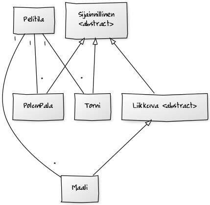

#Aihe:
Simppeli "Tower Defense" tyylinen peli. Toimivan pelin jälkeen laajennuksena voi lisätä kenttäeditorin ja/tai satunnaisgeneroinnin, riippuen siitä, riittääkö aikaa.

Käyttäjän toiminnot:
-Esirakennettujen kenttien pelaaminen
	Sisältää yksinkertaisimmillaan:
	-Tornin lisäämisen
	-Seuraavan vihollisaallon vapauttamisen
	Voi myös sisältää:
	-Tornin muokkaamisen/poistamisen
	-Pelin tallentamisen
-Kentän luominen ja tallentaminen
	Sisältää:
	-Radan piirtämisen
	-Vihollisaaltojen määrittelyn
-Luodun kentän pelaaminen
-Satunnaisgeneroidun kentän pelaaminen

#Luokkakaavio

