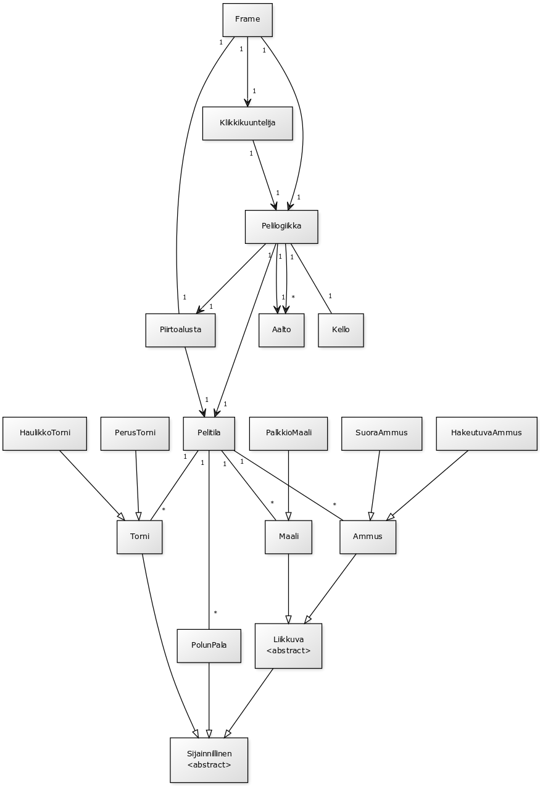

#Aihe:
Simppeli "Tower Defense" tyylinen peli. Toimivan pelin jälkeen laajennuksena voi lisätä kenttäeditorin ja/tai satunnaisgeneroinnin, riippuen siitä, riittääkö aikaa.

Käyttäjän toiminnot:

 * Esirakennettujen kenttien pelaaminen

 Sisältää yksinkertaisimmillaan:
	
  * Tornin lisäämisen

  * Seuraavan vihollisaallon vapauttamisen

 Voi myös sisältää:

  * Tornin muokkaamisen/poistamisen

  * Pelin tallentamisen

 * Kentän luominen ja tallentaminen

 Sisältää:

  * Radan piirtämisen

  * Vihollisaaltojen määrittelyn

 * Luodun kentän pelaaminen

 * Satunnaisgeneroidun kentän pelaaminen

#Aikarajoitteet
Aikarajoitteista johtuen projektin toteutus tulee rajoittumaan perustoiminnallisuuteen, eli toimivaan peliin.

#Luokkakaavio

#Sekvenssikaaviot

Ensimmäinen kaavio kuvaa mahdollista tapausta, jossa Kello kutsuu Pelilogiikan metodia tick(), kun pelimaailmassa on Maali, Ammus ja Torni, jonka lataus on täysi.

Toinen kaavio kuvaa tapausta, jossa pelaaja valitsee ja sijoittaa uuden tornin pelimaailmaan onnistuneesti.

Kolmas kaavio kuvaa tapausta, jossa Pelitilan liiku-metodi saa Ammuksen osumaan Maaliin, jolla on vain 1 hp.

